# TestSuite Architektur

## Systemübersicht

Die TestSuite ist ein umfassendes Bewertungssystem für verschiedene Arten von KI-Modellen, das OpenAI-kompatible APIs für alle Interaktionen verwendet.

## Architecture Diagram

```mermaid
graph TB
    subgraph "Haupt Test Runner"
        A[Haupt Orchestrator] --> B[Konfigurations Manager]
        A --> C[Ergebnis Logger]
        A --> D[Fortschritts Tracker]
    end

    subgraph "Test Suiten"
        E[Allgemeine LLM Tests] --> F[Wissensfragen]
        E --> G[Logisches Denken]
        E --> H[Kreativitätstests]
        E --> I[Ethische/Security Tests]
        
        J[Coding Model Tests] --> K[Python Funktion Aufgabe]
        J --> L[JavaScript Debug Aufgabe]
        J --> M[Code Ausführungs Engine]
        J --> N[Code Evaluator]
        
        O[Audio Model Tests] --> P[Transkriptions Aufgabe]
        O --> Q[Übersetzungs Aufgabe]
        O --> R[Zusammenfassungs Aufgabe]
        O --> S[Audio Vergleichs Engine]
        
        T[VLM Tests] --> U[Multimodale Verarbeitung]
        T --> V[Bildanalyse]
        T --> W[Finale Bewertung]
    end

    subgraph "On-Prem OpenAI-kompatible APIs"
        X[LLM API] --> F
        X --> G
        X --> H
        X --> I
        X --> N
        X --> W
        
        Y[Whisper API] --> P
        Y --> Q
        
        Z[Vision API] --> V
    end

    subgraph "Bewertungssystem"
        AA[Primäres LLM] --> N
        BB[Sekundäres LLM] --> W
        CC[Ähnlichkeits Metriken] --> S
    end

    subgraph "Datenspeicherung"
        DD[Audio Dateien] --> P
        DD --> Q
        DD --> R
        
        EE[Text Referenzen] --> S
        EE --> W
        
        FF[Bild Dateien] --> V
    end

    A --> E
    A --> J
    A --> O
    A --> T
    C --> DD
    C --> EE
    C --> FF
```

## Datenfluss

1. **Konfigurationsphase**
   - API-Schlüssel und Modelleinstellungen laden (alle lokal)
   - Logging-System initialisieren
   - Bewertungsmodelle einrichten (alle On-Prem)

2. **Testausführungsphase**
   - Jede Test-Suite verarbeitet ihre spezifischen Aufgaben
   - Ergebnisse werden gesammelt und geloggt
   - Fortschritt wird in Echtzeit verfolgt
   - Alle Anfragen bleiben intern im Unternehmen

3. **Bewertungsphase**
   - Primäre Bewertungen werden durch zugewiesene lokale LLMs durchgeführt
   - Sekundäre Bewertungen gewährleisten Objektivität
   - Ähnlichkeitsmetriken vergleichen generierte vs. Referenzinhalte
   - Alle Bewertungen erfolgen intern

4. **Dokumentationsphase**
   - Umfassende Testberichte werden generiert
   - Alle Ergebnisse werden mit Zeitstempeln gespeichert
   - Erfolg/Misserfolgsraten werden berechnet
   - Volle Audit-Trail Dokumentation für interne Compliance

## Schlüsselkomponenten

### Haupt Orchestrator
- Koordiniert alle Test-Suiten
- Verwaltet den Ausführungsfluss
- Handhabt Fehler und Wiederholungen

### Test Suiten
- **Allgemeine LLM Tests**: Bewerten Textgenerierung, Wissen und Schlussfolgern
- **Coding Model Tests**: Testen Codegenerierung und Debugging-Fähigkeiten
- **Audio Model Tests**: Bewerten Transkription, Übersetzung und Zusammenfassung
- **VLM Tests**: Handhaben multimodale Aufgaben, die Text, Audio und Vision kombinieren

### Bewertungssystem
- Verwendet verschiedene LLMs für primäre und sekundäre Bewertungen
- Implementiert Ähnlichkeitsmetriken für Textvergleiche
- Bietet objektive Bewertung der Modellleistung

### Datenverwaltung
- Organisierte Speicherung für Testdaten und Ergebnisse
- Versionsverfolgung für Testkonfigurationen
- Umfassendes Logging für Audit-Zwecke